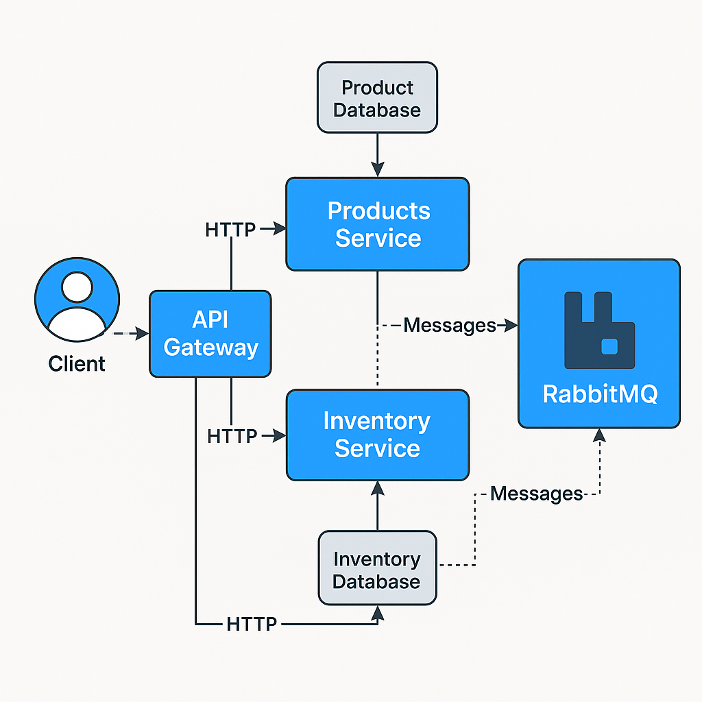
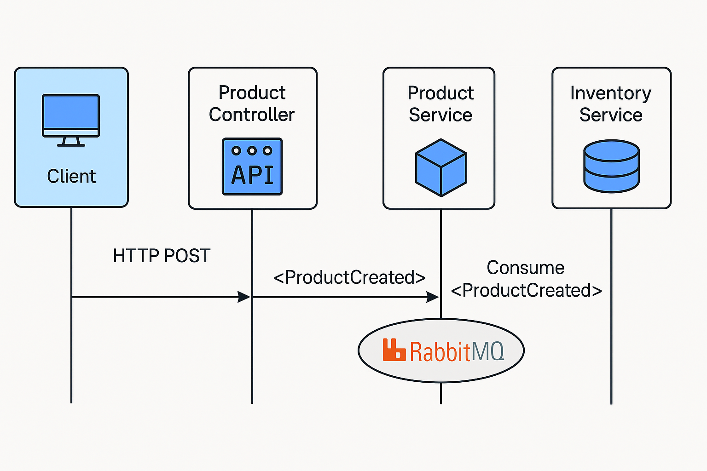

# testApp - Microservicios con MassTransit y RabbitMQ

Este proyecto implementa una arquitectura de microservicios utilizando .NET, MassTransit, RabbitMQ y MySQL, simulando la gestión de productos e inventario para una aplicación distribuida y escalable.

## 🧱 Arquitectura del Proyecto

El sistema está compuesto por dos microservicios principales:

- **ProductService**
  - API REST para la gestión de productos (crear, eliminar, consultar).
  - Emite eventos al crear o eliminar productos mediante **MassTransit** y **RabbitMQ**.
  - Base de datos propia con **Entity Framework Core** y **MySQL**.

- **InventoryService**
  - API REST para la gestión de inventario.
  - Escucha eventos provenientes del `ProductService` para crear o eliminar entradas de inventario.
  - Puede consultar productos a través de un cliente de solicitudes usando **MassTransit Request-Response**.
  - Base de datos propia.

### 📨 Comunicación entre Servicios

- **Mensajería Asíncrona**: Se utiliza RabbitMQ como broker para publicar y consumir eventos de dominio.
- **MassTransit**: Facilita la abstracción de la mensajería y el patrón Request-Response entre servicios.




## 🚀 ¿Cómo se usa?

### Requisitos Previos

- [.NET 7 SDK](https://dotnet.microsoft.com/download)
- [Docker + Docker Compose](https://docs.docker.com/compose/)
- RabbitMQ (se levanta automáticamente con Docker)

### Pasos para ejecutar

1. Clonar el repositorio:
   ```bash
   git clone https://github.com/wepea93/testApp.git
   cd testApp
   ```

2. Levantar la infraestructura con Docker Compose:
   ```bash
   docker compose up --build
   ```

3. Verificar que los servicios estén levantados:
   - `ProductService`: [http://localhost:5001/swagger](http://localhost:5001/swagger)
   - `InventoryService`: [http://localhost:5003/swagger](http://localhost:5003/swagger)
   - `RabbitMQ UI`: [http://localhost:15672](http://localhost:15672) (usuario: `guest`, clave: `guest`)

3. coleccion postman: [postman](https://raw.githubusercontent.com/wepea93/testApp/refs/heads/master/docs/TestApp-API-Collection.postman_collection.json)

### Ejecutar migraciones manualmente (opcional)

```bash
dotnet ef database update --project ./src/ProductService/Infrastructure/Product.Infrastructure.csproj --startup-project ./src/ProductService/Api/Product.Api.csproj

dotnet ef database update --project ./src/InventoryService/Infrastructure/Inventory.Infrastructure.csproj --startup-project ./src/InventoryService/Api/Inventory.Api.csproj
```

## 🔧 Tecnologías utilizadas

- .NET 7
- Entity Framework Core
- MySQL
- RabbitMQ
- MassTransit
- Docker + Docker Compose
- Swagger/OpenAPI

## 🛠 Posibles Mejoras Futuras

### 1. **Observabilidad y Resiliencia**
- Implementar **circuit breaker** y **retry policies** usando **Polly** o **MassTransit Retry Mechanisms**.
- Integrar un sistema de trazabilidad distribuida como **Jaeger** o **Zipkin**.
- Agregar **serilog + Elasticsearch + Kibana** para logs centralizados.

### 2. **Health Checks y Monitoreo**
- Añadir endpoints de salud (`/health`) a cada servicio.
- Usar **Prometheus + Grafana** para métricas y visualización.

### 3. **Seguridad**
- Añadir autenticación y autorización con **JWT** y/o **IdentityServer**.
- Cifrado de datos sensibles y uso de **vaults** para secretos.

### 4. **Escalabilidad con Kubernetes**
- Contenerizar con buenas prácticas para **K8s**.
- Utilizar **Helm Charts** para despliegues.
- Configurar **Horizontal Pod Autoscaler (HPA)** para balancear carga automáticamente.
- Añadir **Ingress Controller** y balanceadores de tráfico.

### 5. **Patrones Arquitectónicos Adicionales**
- Introducir **API Gateway** con **YARP** o **Ocelot**.
- Implementar **Saga Pattern** para manejo de transacciones distribuidas.
- Separar comandos y consultas siguiendo **CQRS**.

## 🤝 Contribuciones

Contribuciones y mejoras son bienvenidas. Abre un issue o haz un PR si deseas colaborar.

## 📄 Licencia

MIT © 2025 [Wilmer Peña](https://github.com/wepea93)